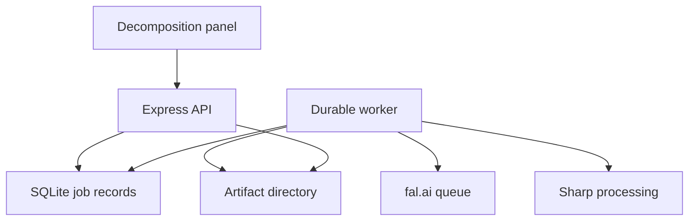

# FrameFlow image decomposition — Codex implementation specification

**Scope:** implement phases 1–10 of the supplied `image-decom-flow.png` in the existing FrameFlow application.

**Repository inspected:** https://github.com/rohitpokhariya10/frameflow  
**Inspected commit:** `5ffc5be5688bd41cc5274776b3bc450faceab4df`  
**Research date:** 25 September 2026. Recheck provider schemas before implementation if they have changed.

This is an implementation contract and execution plan, not a claim that the pipeline has already been built or tested with paid inference. Repository code and the reference diagram were inspected. Official model schemas were checked; no fal.ai key was provided and no live inference was run.

## 1. Instructions to Codex

Implement this specification in the existing repository. First read repository instructions, inspect the current branch and changes, and compare current code with the repository map below. Adapt filenames if the repository has moved on. Preserve unrelated work.

Proceed through the implementation increments in section 16. Complete usable code, migrations, configuration examples, meaningful tests and operating documentation. Do not stop after producing another plan or empty provider wrappers. Resolve routine implementation choices using the defaults here. Do not introduce Kubernetes, microservices, a new frontend framework or another AI provider.

Keep a concise checkpoint in `docs/DECOMPOSITION_PROGRESS.md`: implemented increment, changed files, verification results, concrete blockers and next action. If interrupted, resume from that checkpoint and the actual diff. Distinguish implemented, mock-tested and live-verified capabilities.

When an external dependency is unavailable, finish independent work and report the exact blocked capability. Do not fabricate successful inference, silently replace a model, repeatedly retry a broken endpoint or label a placeholder image as a live result. An explicit review or partial-result state is valid product behavior; an endless loading state is not.

### End result

A user can upload a raster image or select existing artwork, start decomposition, follow durable progress, correct an uncertain mask, and download a layer package containing:

- Separate cropped RGBA PNGs for selected objects, with native-canvas placement metadata.
- Original visible pixels extracted from a normalized, full-resolution working master.
- A reconstructed background, with generated areas identified.
- Optional completed object variants with generated hidden parts identified.
- Lossless masks, a versioned JSON manifest, a preview and a quality report.
- Accurate complete, partial, needs-review, failed and cancelled states.

“Editable layers” at phase 10 means separate image assets, masks and placement data. It does not mean editable vector shapes, editable text extracted from a photo, or a completed new layer editor.

## 2. Is one fal.ai API key enough?

**Yes for the AI inference in this design.** Use one server-side `FAL_KEY` with API scope for the hosted model endpoints below. No separate OpenAI, Gemini, Hugging Face or direct Black Forest Labs key is required. The account must have sufficient credits and access to the selected endpoints. Each invocation can incur its own charge. [S1–S7]

The key does not supply application hosting, durable job records, access control, image processing or permanent storage. Implement those in the existing Node application:

| Requirement | Initial implementation | Additional paid API key? |
| --- | --- | --- |
| AI decomposition, segmentation, inpainting | fal.ai hosted endpoints | One `FAL_KEY` |
| Crop, alpha handling, image validation, compositing | Sharp in Node.js | No |
| Durable jobs and metadata | SQLite on a persistent local volume | No |
| Artifact files | Filesystem on that same persistent host | No |
| API and background execution | Existing Express app plus one worker process | No; hosting still needs provision |
| Private operator access | Local application session authentication | No external identity service required |

This default supports a **private, single-host deployment**. It is not a claim of highly available, horizontally scaled SaaS infrastructure. Keep database and artifact interfaces replaceable; external object storage and a shared production database can be added later.

Sharp is still needed in phases 1–10 even though the diagram also mentions it in phase 13. Here it validates images, maps masks, extracts original pixels and packages layers. Those operations are not the future full editor export feature. Do not replace them with another generative call.

## 3. Scope boundaries and corrections to the diagram

| Diagram assumption | Implementation rule |
| --- | --- |
| Input is always 4K | Preserve the actual image dimensions. A 1920×1080 source produces a 1920×1080 composition space; 3840×2160 remains 3840×2160. Never upscale automatically. |
| Qwen provides semantic descriptions and exact layers | Its checked response has `images[]`; it does not promise an object-description list, exact registration or trustworthy depth order. Use it as a proposal source. [S2] |
| SAM2 returns one correct mask per object | It supplies candidates. They may be duplicates, nested regions, object parts or background regions. Select and validate them. |
| Finegrain makes the object mask | The `/mask` endpoint consumes a supplied erase mask. Use SAM and optional matting for mask creation. [S6] |
| BiRefNet is an arbitrary-object mask refiner | It estimates foreground/matting from an image. It has no checked arbitrary trimap/mask input here. Constrain results using the selected object's support region. [S5] |
| Inpainting recovers the real hidden image | It produces plausible new content. Hidden pixels cannot be recovered from a single image. |
| Upscaling a mask restores all 4K edge detail | It only changes its sampling grid. High-resolution crops and review may still be necessary. |
| Any person holding a board has a simple layer order | The board can be in front of the torso while fingers are in front of the board. Preserve visible ownership and support component splitting/review. |
| Lossless PNG guarantees perfect extraction | It avoids further codec loss. Segmentation and mixed foreground/background edge colors still limit accuracy. |
| Storage can wait entirely until phase 11 | Minimal durable checkpoints and artifacts are required now. The full cloud asset system remains outside scope. |

**Do not implement phase 11's S3/R2 product, phase 12's full editor, or phase 13's transformed 4K export engine.** Reuse the existing UI for a decomposition panel and a limited review/result viewer. Provide downloadable editor-ready assets. Preserve existing generation, adaptation, text editing and PNG export behavior.

## 4. Actual repository integration map

The inspected repository is an npm-workspaces TypeScript application, not Next.js:

| Existing location | Observed behavior | Integration guidance |
| --- | --- | --- |
| Root `package.json` | `client`, `server`, `shared`; Node `>=22.12.0`; build/typecheck/lint/Vitest/Playwright scripts | Keep workspaces and existing scripts; add worker and decomposition verification scripts. |
| `server/src/app.ts` | Express 5, CORS, `/api/health`, generation/adaptation routes, error normalization | Add a separate decomposition router and config. Keep existing dependency injection usable in tests. |
| `server/src/index.ts` | API startup and optional built-client serving | Start the API here; use a separate worker entry point. |
| `server/src/services/aiService.ts` | Existing single-result AI service | Do not force a durable multi-stage pipeline into this request lifecycle. |
| `server/src/providers/*` | Gemini and Cloudflare adapters | Add a dedicated fal decomposition adapter. Do not overwrite provider selection for existing tools. |
| `shared/src/ai.ts` | Existing `ImageProvider` union and base64 artwork response | Keep decomposition contracts separate. Do not reuse this base64 response for a bundle of layers. |
| `shared/src/index.ts` | `ProjectDocument.schemaVersion = 1`; `DesignVariant.elements` holds text only | Add exported decomposition types separately. Phase 10 does not require converting text elements into a generic scene graph. |
| `client/src/lib/persistence/schema.ts` | Strict v1 schema rejects unknown fields | Do not attach unvalidated layer fields to existing project JSON. |
| `client/src/lib/assets/assetRepository.ts` | Image Blobs stored by stable ID in IndexedDB | Resolve existing artwork to bytes for upload. Keep object URLs transient. |
| `client/src/lib/assets/projectAssetIds.ts` | Finds assets referenced by documents, history and previews | Any future layer-document integration must extend this traversal before assets are cleaned up. |
| `client/src/store/index.ts`, `history.ts`, `projectReset.ts` | Separate document/history, UI, save and AI states; stale-result guards | Add a separate decomposition slice. Protect project identity/revision and reset behavior. |
| `client/src/features/canvas/CanvasWorkspace.tsx` | Konva text and background rendering | Reuse the visual style; a standalone result preview can compose layer thumbnails. |
| `client/src/features/export/exportPng.ts` | Builds an independent Konva scene for existing export | Leave this export contract intact. Layer ZIP download is a different operation. |

Current canvas limits are 256–4096 per side and 12,000,000 pixels. These already include common 1080p and 3840×2160 images, but not 4096×4096. Existing artwork transport has an 8 MiB image limit; decomposition needs its own streamed upload/download limits.

No application login, durable server job database, server artifact store or worker was found in the inspected code. Implement them for this feature; do not assume they exist. No `AGENTS.md` was found in the inspected repository; recheck the execution checkout.

### Keep project persistence stable

Use a separate versioned decomposition manifest, server job records and a small browser recovery index such as `frameflow:decomposition-jobs:v1`, keyed by project ID. Keep the existing project v1 shape unchanged for this scope. Results are reviewed/downloaded separately and must never auto-replace the artwork.

If a later request asks to place layers inside the editable project, implement a deliberate schema migration, image-node support, asset traversal, history and export together. Do not smuggle this unfinished phase-12 work into phase 10.

## 5. Architecture and default runtime



Use one repository, one API process and one worker process on the same host. SQLite and the artifact directory must live on a persistent volume. Queue state is in the database, not an array, a browser tab or an untracked promise.

- Preferred server dependencies: `@fal-ai/client`, `sharp`, `better-sqlite3`, a bounded multipart streaming parser, and a maintained streaming ZIP writer. Add corresponding TypeScript declarations when needed.
- Use existing validation conventions or add a small schema library only if it meaningfully reduces duplicated validators.
- Check compatibility with the repository's Node version before pinning new dependencies. Update the lockfile and keep ESM/NodeNext imports consistent.
- Use SQLite WAL, foreign keys, a busy timeout, explicit migrations and short transactions. Do not keep transactions open during network or image operations. [S12]
- Use atomic file writes: unique temporary file, flush/close as appropriate, then rename on the same volume. Register finalized artifact metadata transactionally; reconcile orphan temporary files after crashes.
- Scope storage access to owner/job/artifact records; do not expose the artifact directory with `express.static`.
- Default to one active job and at most two simultaneous model requests across the worker. Add a separate small Sharp concurrency limit and a bounded download queue.
- Use provider queue polling first. It works without a public callback URL or tunnel. Webhooks are optional, not a prerequisite for a working pipeline.

The initial filesystem/database profile is for one host with local durable disk. Do not deploy independent replicas with separate disks or mount the SQLite database on arbitrary shared/network storage. Scaling across hosts requires a deliberate shared-database and storage change.

## 6. Provider contracts — exact endpoint responsibilities

Put endpoint IDs and adapter versions in one server-only registry. Store the endpoint, input hash, seed when supplied, adapter version, provider request ID and decoded output dimensions for every call. Runtime-validate responses; TypeScript alone does not validate a network response.

The following field mappings were checked against official API pages. They are a starting contract, not permission to invent other fields or assume unspecified size limits.

| Purpose | Endpoint | Important input fields | Output to normalize |
| --- | --- | --- | --- |
| Layer proposals | `fal-ai/qwen-image-layered` | `image_url`, `num_layers`, `output_format: "png"`; optional seed | `images[]`; validate decoded RGBA; no assumed per-layer labels |
| Automatic mask candidates | `fal-ai/sam2/auto-segment` | `image_url`, `output_format: "png"`; documented sampling/threshold fields | `individual_masks[]`; `combined_mask` is only a diagnostic preview |
| Targeted object segmentation | `fal-ai/sam-3/image` | `image_url`, explicit `prompt`/points/boxes, `apply_mask: false`, `return_multiple_masks: true`, bounded `max_masks`, scores/boxes flags | `masks[]`; optional metadata, scores and boxes |
| Foreground alpha candidate | `fal-ai/birefnet/v2` | `image_url`, appropriate documented `model`/resolution, `mask_only: true` | With `mask_only`, `image` contains the mask; do not assume `mask_image` always exists |
| Background reconstruction | `fal-ai/finegrain-eraser/mask` | `image_url`, `mask_url`, `mode: "standard"`; optional seed | `image`; normalize the actual returned encoding |
| Hidden-region completion / configured erase fallback | `fal-ai/flux-pro/v1/fill` | `image_url`, `mask_url`, **required `prompt`**, `num_images: 1`, `output_format: "png"` | `images[0]`; image and mask inputs must have identical dimensions |

Sources: [S2–S7].

Additional adapter rules:

- SAM3 point coordinates and input boxes use the supplied image's pixel space. Point labels distinguish positive/negative guidance. Output boxes use normalized center/width/height coordinates; convert them before using them as pixel rectangles. Never mix these two conventions. [S4]
- Always send the intended SAM3 prompt/guidance; never accidentally rely on its documented default prompt.
- Do not invent an `input_mask`, `trimap`, `resolution: "4k"`, `image_size`, `labels` or `depth` field on an endpoint that does not support it.
- Decode masks according to each adapter's verified output encoding. Opaque grayscale masks use luminance; RGBA cutouts may use alpha. Do not assume a PNG's alpha channel contains a useful mask just because the file has four channels.
- Finegrain's white binary pixels mark the erase region. Establish and contract-test the same normalized white-means-edit convention for every inpainting adapter. [S6]
- BiRefNet's documented operating sizes are model-dependent; use a supported model/resolution pair. Its 2K-sized processing does not prove native 4K detail. [S5]
- Keep provider safety defaults enabled. A refusal/flagged response is an explicit status, not a reason to try another model to circumvent it.
- BRIA is outside the initial required chain. Do not use the diagram's informal `bria/extract-object` label as a verified endpoint.

### Queue transport

Use `fal.queue.submit`, persist `request_id`, then poll `fal.queue.status` and retrieve `fal.queue.result`. Use the installed SDK's current types. A process must be able to restart and resume the saved request rather than submit it again. Do not keep the original HTTP request open until all ten phases finish. [S8]

Upload provider inputs server-side with `fal.storage.upload` when needed. A browser `blob:` URL and `localhost` file URL are not remotely fetchable provider inputs. Download successful provider outputs promptly into application-controlled storage; URLs alone are not durable artifacts. fal media retention is configurable and its CDN URLs are public by default. Configure the available access/retention controls deliberately and document them. [S9]

Do not promise exactly-once external billing. A crash between provider acceptance and local request-ID persistence can be ambiguous. Record `SUBMITTING` before the network call. If no durable request ID exists after an ambiguous failure, mark `SUBMISSION_UNKNOWN` and require reconciliation or an explicit new attempt; do not blindly resubmit. App-level idempotency does not prove provider-level idempotency.

## 7. Canonical coordinates, pixels and masks

### Image spaces

Keep original uploaded bytes immutable. Separately derive an orientation-corrected, sRGB working master with known width `W` and height `H`. The initial processing contract is 8-bit SDR: explicitly reject unsupported HDR/high-bit-depth input or record an intentional conversion; do not silently claim preservation of that source precision. Hash both files. Native coordinates always refer to this working master. Document that orientation/color normalization can change raw file representation; fidelity comparisons use the working master.

For analysis:

```text
scale = min(1, analysisMaxSide / max(W, H))
analysisWidth  = max(1, round(W * scale))
analysisHeight = max(1, round(H * scale))
scaleX = analysisWidth / W
scaleY = analysisHeight / H
```

Default `analysisMaxSide = 1024`. Derive dimensions from actual rounding; do not assume both scale factors are identical. Do not stretch portrait input into 1024×576.

Represent every model-input transform explicitly, including crop origin, actual resize dimensions and padding. For a native crop with origin `(cx, cy)` and model padding `(px, py)`:

```text
modelX = (nativeX - cx) * scaleX + px
modelY = (nativeY - cy) * scaleY + py
nativeX = (modelX - px) / scaleX + cx
nativeY = (modelY - py) / scaleY + cy
```

Define raster sampling using pixel centers consistently and test border pixels. Unpad first when mapping model output back. Use exclusive right/bottom bounding-box bounds; floor the left/top and ceil the right/bottom, then clamp to the native canvas.

- Binary ownership/edit masks: nearest-neighbor resampling, revalidate 0/255 values.
- Soft alpha: bilinear or a carefully selected smooth filter; clamp to [0,1] and guard halos.
- RGB source layers: extract at native pixel scale; never obtain them by enlarging a model layer.
- For a provider output with changed aspect ratio, unexplained crop or failed alignment: reject or review; do not silently stretch it to fit.

### Separate mask meanings

| Mask | Meaning |
| --- | --- |
| `visibleOwnership` | Pixels observed as belonging to this object in the source |
| `alpha` | Final opacity of that layer, including optional generated support |
| `amodalProposal` | Estimated full object shape, possibly behind occluders; never treated as observed truth |
| `generationMask` | Pixels whose content is authorized to be invented/changed |
| `protectedMask` | Pixels generation must not replace |
| `generatedSupport` | Final artifact pixels containing generated or blended generated content |

Use grayscale PNGs with documented polarity. Keep each mask's image-space metadata. A bbox intersection is not itself a valid segmentation or inpainting mask.

### Fidelity policy

Opaque, confidently observed object RGB must come from the working master. Never replace an entire person with a Qwen or FLUX output to obtain a completed torso. Build final assets by locally combining original visible RGB and authorized generated regions.

For an inpainted scene patch, with an edit blend mask `E` in [0,1]:

```text
finalRGB = originalRGB * (1 - E) + generatedRGB * E
```

Set `E = 0` throughout protected regions, even if the provider modified them. Any feather/blend support is part of `generatedSupport`. Complete-object alpha comes from validated segmentation/matting of the candidate plus preserved visible support, not the RGB formula alone.

Store straight/unassociated alpha in PNG. Avoid applying alpha twice when using premultiplied compositing internals. For a visible-only cutout, combine source alpha with the object mask rather than discard source alpha.

Do not claim that arbitrary hair/glass edges can simultaneously preserve every original RGB byte and look perfect over any new background. Edge pixels may already contain the original background color. Keep a faithful-source mode; any optional edge decontamination must be a separate derived variant with provenance.

## 8. Durable state, API and data model

### Tables and constraints

Implement migrations for at least:

| Table | Required data / constraint |
| --- | --- |
| `owners`, `sessions` | Private operator identity, hashed session tokens, expiration/revocation |
| `source_assets` | Owner, file keys, original/working hashes, decoded dimensions, MIME, metadata |
| `decomposition_jobs` | Owner/source, options hash, idempotency key, state, revision, phase, deadlines, budget counters, cancel flag, timestamps |
| `decomposition_steps` | Job, phase/object, input hash, attempt, status, lease owner/expiry, fencing version, output artifact refs |
| `provider_requests` | Step, endpoint, submission state, provider ID, seed, sanitized diagnostics, cost reservation |
| `artifacts` | Owner/job, immutable relative storage key, kind, bytes, dimensions, SHA-256, MIME, retention state |
| `job_events` | Monotonic sequence, job revision, phase/event/error code and sanitized progress |

Unique `(ownerId, idempotencyKey)` prevents double-click duplicate jobs. Reusing a key with different content returns 409. Use `(jobId, phase, objectId, inputHash, attempt)` or an equivalent unique execution identity. Never let a stale worker overwrite a newer revision.

### Job states

Use `queued`, `running`, `needs_review`, `completed`, `partial`, `failed`, `cancel_requested`, `cancelled`.

- `needs_review` includes a specific reason, preview artifacts and allowed corrective actions. It is paused, not an active spinner or worker lease.
- `completed` means all requested/required outputs passed validation. Intentionally unnecessary or disabled optional steps are recorded as skipped.
- `partial` means usable assets exist but a requested capability failed, was excluded or could not be verified. Include warnings in the download.
- Cancellation stops scheduling new calls, requests provider cancellation where possible and discards late results from publication. Already running inference can still finish and may be charged. [S8]
- `deadlineExceeded` and `SUBMISSION_UNKNOWN` are explicit error/review reasons with a resumable record; never silently restart the whole job.

### HTTP surface

Use stable opaque IDs and the repository's `{ error: { code, message, retryable, requestId } }` error style. All feature routes enforce ownership.

| Route | Contract |
| --- | --- |
| `POST /api/decomposition/session` | Private operator login; rate limited; issue secure session cookie |
| `POST /api/decomposition/logout` | Revoke current session |
| `GET /api/decomposition/capabilities` | Enabled/configured state and size/feature limits; no secrets; configuration is not proof of working credits |
| `POST /api/decomposition/assets` | Stream one multipart image; validate/store master; return source asset ID |
| `POST /api/decomposition/jobs` | JSON source ID/options plus `Idempotency-Key`; return 202 with job ID and status URL promptly |
| `GET /api/decomposition/jobs/:id` | State, revision, current phase, progress, warnings, review actions and ready artifacts |
| `GET /api/decomposition/jobs/:id/events?after=N` | Bounded sequence-based event retrieval for recoverable progress |
| `POST /api/decomposition/jobs/:id/cancel` | Idempotent cancellation request |
| `POST /api/decomposition/jobs/:id/review` | Expected revision, mask corrections/labels/order/completion choice; validate and requeue affected work |
| `POST /api/decomposition/jobs/:id/retry` | Retry a known failed step within budget, or explicitly reconcile ambiguous submission |
| `GET /api/decomposition/jobs/:id/result` | Ready versioned manifest; otherwise 409 with current state |
| `GET /api/decomposition/artifacts/:artifactId` | Authenticated streaming response with verified MIME/length; no arbitrary path parameter |
| `GET /api/decomposition/jobs/:id/download` | Streaming ZIP for a published completed/partial result |
| `POST /api/decomposition/jobs/:id/delete` | Ownership-checked cancellation/tombstone followed by reference-safe artifact cleanup |

Mount upload and optional raw-webhook middleware at the correct point in `app.ts`; do not enlarge the existing global 24 KiB JSON limit to carry image files. Give review JSON its own bounded limit. Existing CORS currently uses `credentials: false`; configure credentialed access only for the new authenticated feature and explicit allowed origins, or use a same-origin development proxy. Do not combine wildcard origins and cookies.

### Job options

Validate, hash and persist options such as `maxObjects`, optional target labels, `qualityProfile`, `completeHiddenObjects`, background reconstruction, allowed fallback and the per-job call budget. Server maxima override larger client values. Prefer named quality presets over exposing every model field.

For existing artwork, upload the stored image Blob, not a scaled viewport screenshot, a 511-pixel adaptation reference, or a Konva stage containing text. Record project/variant/source-asset/revision as client context, but do not treat client IDs as authentication.

### Manifest contract

Implement runtime validation for the actual contract. This sketch defines required concepts; use discriminated unions where they reduce ambiguity:

```ts
type ArtifactRef = {
  artifactId: string;
  relativePath: string; // package path, never an absolute server path
  sha256: string;
  mimeType: string;
  bytes: number;
  width: number;
  height: number;
};

type LayerRecord = {
  id: string;
  objectId: string;
  groupId?: string;
  label: string;
  labelSource: 'user' | 'target-prompt' | 'generic';
  kind: 'object' | 'background' | 'residual' | 'object-component';
  zIndex: number; // 0 is bottom; confidence is recorded separately
  bbox: { x: number; y: number; width: number; height: number };
  rgba: ArtifactRef; // cropped native-scale image; equals bbox dimensions
  alpha: ArtifactRef; // same crop as rgba
  visibleOwnership: ArtifactRef; // same crop, unless explicitly full-canvas
  generatedSupport?: ArtifactRef; // same crop, includes blending support
  visibleOnlyRgba?: ArtifactRef;
  generation: 'none' | 'partial' | 'fully-generated';
  completionStatus: 'not-needed' | 'completed' | 'skipped' | 'needs-review' | 'failed';
  provenanceStepIds: string[];
  quality: { reviewRequired: boolean; warnings: string[]; metrics: Record<string, number> };
};

type DecompositionManifest = {
  schemaVersion: 1;
  pipelineVersion: string;
  jobId: string;
  revision: number;
  status: 'completed' | 'partial';
  source: {
    originalSha256: string;
    workingMasterSha256: string;
    width: number;
    height: number;
    colorSpace: 'srgb';
    orientationNormalized: boolean;
  };
  coordinateSystem: 'working-master-pixels';
  alphaMode: 'straight';
  layers: LayerRecord[];
  occlusion: {
    frontLayerId: string;
    backLayerId: string;
    confidence: number;
    decisionSource: 'heuristic' | 'user';
    regionArtifactId?: string;
  }[];
  warnings: string[];
  createdAt: string;
};
```

Add a separate provenance section/artifact recording model endpoint, provider request ID, actual processing dimensions, crop transform, settings hash and seed for generated/refined outputs. If an immutable provider model revision is not exposed, record that it is unknown; a fixed seed alone is not a guarantee of future reproducibility.

Manifest paths must resolve inside the ZIP. The server result can additionally expose authorized artifact routes; do not persist provider URLs, expiring download tokens or local absolute paths in the portable manifest.

## 9. The ten pipeline phases

Each phase has durable inputs, artifact outputs, a bounded attempt policy and a validation gate. Cache only owner-scoped immutable outputs with matching source/settings/adapter hashes. A corrected mask invalidates dependent extraction, occlusion, generation and package outputs, not unrelated valid proposals.

### Phase 1 — Input image and immutable source

1. Accept static PNG, JPEG and WebP initially. Reject SVG, animated/multipage content and unsupported encodings with an actionable message.
2. Stream to a bounded temporary file; verify magic bytes and fully decode with Sharp. Check pixel count, dimensions, channels, truncation and upload size before processing.
3. Retain the exact original bytes and SHA-256. Create the oriented sRGB master separately. Retain original alpha where present; use a derived opaque analysis composite if a model cannot handle transparency.
4. Register source artifacts only after successful validation. Expire abandoned uploads via cleanup.

**Gate:** source and master hashes/dimensions exist, no arbitrary file paths/URLs are accepted, and malformed input cannot start paid inference. A transparent input's empty canvas is not automatically treated as missing background to generate.

### Phase 2 — Low-resolution analysis image

Create the aspect-preserving analysis PNG using section 7. Record exact native/analysis transform, padding if any and the analysis hash. Generate a lightweight UI preview separately. Small originals must not be enlarged just to hit 1024 pixels.

**Gate:** portrait, landscape, odd dimensions and EXIF-rotated fixtures map masks back correctly. Preview dimensions are never substituted for source dimensions.

### Phase 3 — Semantic layer proposals with Qwen

Submit the analysis image to Qwen using a bounded layer count (default four proposals). Download and decode returned images. Record their actual dimensions and alpha support. Keep generic names such as `Object 1` when labels are not supplied.

Use alpha support and placement only as proposals. Qwen may hallucinate hidden material, shift geometry or produce non-object layers. Evaluate alignment and overlap with source-derived segmentation in phase 4. Never accept Qwen RGB as original object RGB.

If proposals are missing, unusable or misregistered, record `PROPOSAL_UNRELIABLE` and continue with SAM2 candidates/targeted user guidance. Such a run can still produce valid layers if all final quality gates pass. Do not add an undocumented vision-language model to invent descriptions.

**Gate:** proposal image geometry is documented; no code references nonexistent `result.layers`, descriptions or guaranteed depth order.

### Phase 4 — Object segmentation and candidate selection

1. Run SAM2 on the analysis image. Download individual masks; do not treat a colored combined mask as a single object's alpha.
2. Normalize each mask; calculate area, bounds, connected components and pairwise overlap.
3. Match registered Qwen alpha proposals to candidates using overlap and inclusion statistics. Separate visible agreement from speculative hidden support.
4. Deduplicate near-identical masks. Preserve disconnected pieces of one object where appropriate; do not keep only the largest component and accidentally delete hands, legs or handles.
5. Prefer a bounded set of meaningful objects. Record rejected candidates and reason. If there are more candidates than the object cap, ask for selection rather than silently dropping an important object.
6. Use explicit target labels/points/boxes for SAM3 when available. Generic layer IDs are acceptable when semantic names are unknown.

Useful initial heuristics, to calibrate on fixtures: flag near-duplicates above 0.95 IoU; flag major unexplained disagreement between a trusted selection and a returned mask. These are product heuristics, not guarantees of semantic correctness. Tiny objects must remain manually selectable.

**Gate:** the person/board fixture yields distinct visible masks, and the board mask excludes the face and gripping fingers. If ownership is uncertain, persist candidates and enter review. Do not proceed to erasure with a suspect mask.

### Phase 5 — Targeted refinement and alpha edges

Refine selected objects on a padded crop from the high-resolution master when that provides meaningful additional detail. Convert guidance into that crop's model-input coordinates. SAM3 positive guidance should land inside the intended object; negative guidance should exclude nearby person/board/background regions.

For the board regression: use positive board points/box and negative points on face, shirt and fingers. Validate the returned mask against those exclusions. A board is not simply its rectangular bbox; fingers occluding it must remain excluded from the observed board mask.

For hair/fur/soft boundaries, run BiRefNet on a suitable object-centered crop and use its output only as an alpha proposal. Derive a local trimap from the accepted SAM support: certain foreground, uncertain boundary, certain background. Preserve foreground/background constraints and use the matting proposal within the uncertainty band. Do not send this trimap as an invented BiRefNet API parameter.

Reject any refinement that imports neighboring objects, removes protected visible regions or exceeds the permitted support. Do not multiply two feathered masks blindly, which can shrink the object. Sharp edge objects usually need less matting than hair.

Bound automatic corrections to at most one additional guided attempt per object within the global budget. Then offer brush/point correction, selection of another candidate, or a partial visible-only result.

**Gate:** all masks have verified polarity, dimensions, object identity and native placement. Hair quality is inspected on light/dark checkerboards; a large resized mask is not described as proven native-resolution segmentation.

### Phase 6 — Extract original-resolution visible layers

Map accepted masks back to native space. Extract RGB from the working master and attach alpha locally. Compute a tight nonzero-alpha bbox with small transparent padding; preserve the integer native offset and avoid clipping edge pixels.

Write lossless cropped RGBA PNGs, visible masks and per-layer metadata. Use stable IDs; filenames should not depend on AI text. Preserve visible-only assets even if later completion succeeds.

Keep observed background/residual content for reconstruction and coverage auditing. Every observed pixel must be attributed to a visible object or retained background/residual region. An unclassified region must not silently disappear.

**Gate:** opaque interior RGB equals the corresponding working-master pixels after decoding; bboxes and crop masks have consistent dimensions; PNG alpha is real transparency. Checkerboard graphics must not be baked into the actual files.

### Phase 7 — Occlusion analysis and completion planning

Infer candidate relations from visible boundaries, registered amodal proposals and user guidance. Record confidence and evidence. Ordinary mask overlap, touching regions or bbox intersection alone cannot prove depth or missing anatomy.

For each object, distinguish visible support from proposed full shape. A provisional hidden region can be estimated as:

```text
hiddenCandidate = amodalProposal intersect acceptedOccluderCoverage
hiddenCandidate = hiddenCandidate minus visibleSupport minus protectedRegions
```

It is still an estimate. If object identity, depth or shape is ambiguous, request a label/order/mask correction. Do not automatically generate a torso merely because an object is near a person. If no supported hidden region exists, skip phase 9 with reason `not-needed`.

Handle interleaving: board in front of torso, fingers in front of board. Visible-only masks can preserve the current arrangement; a reusable completed assembly may need separate hand/front components grouped with the person. Build a DAG at the component level or request review. Never silently topologically sort a cyclic object relation or repaint fingers onto the board.

Produce separate plans for the **empty scene background** and for **hidden parts of individual objects**. Removing the board to reveal a shirt is not the same operation as generating the empty scene behind the person and board.

**Gate:** every generation mask names its target layer, occluders, protected regions and uncertainty. Unsupported completion is skipped/reviewed explicitly.

### Phase 8 — Remove selected objects and reconstruct background

For the background plate, erase the union of selected foreground objects/components, including approved associated contact-shadow areas when necessary. Keep unselected objects in the background deliberately and record that choice. Erasing only the board does not create an empty background behind the person.

Use a binary erase mask with small, scale-aware expansion where justified. Finegrain Eraser is primary. Enable FLUX Fill as a configured, one-attempt fallback only for a known failed/invalid erase result or unavailable eraser endpoint, within budget. Do not apply this fallback to authentication failures, insufficient funds or safety refusals.

Generate on a provider-compatible scene image or contextual native crop. Record actual input/output sizes; if downscaling is required, identify the generated patch's effective resolution. Avoid independent tiny tiles for a large connected region; they can produce inconsistent structure.

Validate geometry, then copy generated pixels into the native background plate only under the authorized erase/blend mask. Keep unmasked background pixels from the master, even when the model changes the whole frame. A JPEG provider result may be decoded and stored as PNG, but that does not undo its existing compression loss.

Review removal residue, repeated objects, seams and scene continuity. These checks include human visual evaluation; dimensions and hashes cannot prove realistic inpainting.

**Gate:** the background plate is native canvas size, selected objects are plausibly removed, and pixels outside generated support/protected boundaries are preserved. Failed reconstruction yields a clearly incomplete/partial background, not a false clean plate.

### Phase 9 — Generate hidden object content, only when needed

For each approved target, in bounded order:

1. Build a context crop from the original scene or a deliberately derived intermediate, not the empty scene background. Include enough visible object context to infer material, lighting and boundaries.
2. Build the target's hidden-content mask. Protect face, visible hands and all reliable original parts. If context removal needs a wider edit region, record it separately from the final object generation support.
3. Supply a specific FLUX Fill prompt, e.g. continue the visible blue shirt across the board-covered torso with consistent pose/lighting. This is an example application prompt, not a guarantee of anatomy or garment recovery.
4. Download and validate the candidate; align it to native space.
5. **Segment the completed target again** using guided SAM3; optionally refine alpha. Inpainting returns a scene image, not an automatically isolated transparent person.
6. Build a completed-object variant using original visible RGB plus accepted generated RGB within the hidden region and the validated completed alpha. Exclude any generated background outside the target.
7. Keep the visible-only object as a reversible alternative. Mark all generated/blended pixels and record provenance.

Support optional completion of the board behind fingers as a separate target. Completing the person must not automatically alter the board or the visible hands. If component interleaving cannot be represented with a reliable layer order, return review/visible-only output.

Default to at most two hidden-object completions per job. Never keep generating until a subjective score happens to improve. One configured quality attempt plus at most one explicit retry is enough before review/partial output.

**Gate:** no background leaks into the completed object; protected visible areas retain source pixels; generated parts are labeled as generated. On failure keep phase-6 assets and publish partial output when appropriate.

### Phase 10 — Final layer assets, manifest and result viewer

Publish a result only after artifact validation and a database commit. Stream a ZIP containing a layout such as:

```text
manifest.json
quality-report.json
provenance.json
README.txt
layers/layer-001.png
layers/layer-002.png
layers/background.png
visible-only/layer-001.png
masks/layer-001-alpha.png
masks/layer-001-visible.png
masks/layer-001-generated.png
previews/composite.png
previews/contact-sheet.webp
```

Filenames and presence are determined by the manifest, not this example. Include a residual layer when needed and identify it. Do not include secrets, provider authorization headers, session tokens, absolute paths or uncontrolled log dumps. Original source inclusion is optional; hashes and canvas dimensions are required.

Provide a limited result viewer with checkerboard, individual layer visibility, original/composite comparison, generated-region overlay, warnings and download controls. Visibility here is for inspection; do not implement the full drag/rotate/resize/reorder editor.

Build the composite from packaged assets at recorded placement. Do not use the original image as a hidden extra background to make reconstruction appear correct. Show layer assets independently so retained source pixels cannot conceal missing extraction.

**Gate:** native composition dimensions, valid PNGs, complete path/hash references, reasonable source reconstruction, visible generation provenance and a working ZIP download. Rasterized text inside an image remains rasterized; existing separately editable text stays unchanged.

## 10. Reliability, retries and keeping the pipeline responsive

### Worker lifecycle

- Claim due work in a short transaction with a lease and fencing version. Heartbeat while doing expensive work. Publication requires matching the current lease/job revision.
- Persist before and after each model call and local phase. Mark a step complete only when its output artifacts are durable.
- On startup, recover expired leases. Resume known provider request IDs; reuse verified completed artifacts. Do not start the entire pipeline again.
- Poll according to durable `nextPollAt` timestamps with jitter/backoff. Use no tight loop. Distinguish queue time from processing time.
- Serve client progress from local job records. Client polling does not directly poll fal for every browser tab.
- Refreshing/closing the browser does not cancel the job. A user cancellation is explicit.
- A corrected mask increments the job revision and invalidates only dependent outputs. Late results for older revisions cannot become the new result.

### Default bounds

These are initial application settings, not provider service guarantees. Make them configurable and document them:

| Setting | Default |
| --- | --- |
| Upload formats | Static PNG, JPEG, WebP |
| Upload size | 25 MiB |
| Native dimensions | 256–4096 per side, at most 12,000,000 pixels |
| Analysis longest side | 1024 pixels, never upscale |
| Selected foreground objects | At most 6 |
| Initial Qwen proposal count | 4 |
| Hidden-object completions | At most 2 per job |
| Active jobs | 1 |
| Simultaneous model calls | 2 maximum, also bounded by account limits |
| Total new model submissions | 20 per job, including retries/fallbacks |
| Network call timeout | 30 seconds for submission/status/metadata calls |
| Download timeout | 60 seconds, streamed, with a bounded size |
| Individual model-step active deadline | 5 minutes initially; configurable per endpoint |
| Total active job deadline | 20 minutes, excluding deliberate review pauses |
| Provider polling | Start around 2 seconds; back off toward 15 seconds with jitter |
| Artifact fetch bound | 128 MiB per decoded/downloaded image path; also enforce dimensions/pixels |
| Per-job artifact disk cap | 512 MiB, checked incrementally |
| Browser result preview side | 1024 pixels; download full assets on demand |
| Retention | 7 days initially, displayed in the UI; pin/extend explicitly if required |

Do not decode all 4K candidates and masks at once. One 3840×2160 RGBA buffer is roughly 32 MiB before processing overhead. Release buffers promptly; bound SAM candidate downloads and work in crops/sequences. Set an explicit initial candidate cap, e.g. 64 masks per response/job phase. If the provider returns more candidates than the safe processing limit, show a bounded selection/review path rather than consuming unbounded memory. Oversized provider responses must also be bounded before they are fully buffered; verify the installed SDK transport supports the limit or implement the documented REST calls with a bounded transport.

### Error policy

| Condition | Action |
| --- | --- |
| Invalid image/options, impossible dimensions | Fail before inference; no retry |
| 401/403, missing key or insufficient credit | Configuration/billing error; no model carousel |
| Known request ID, temporary status/download failure | Retry lookup/download, not submission; respect Retry-After |
| 429 before known accepted submission | Bounded delayed retry after classifying acceptance certainty |
| 5xx/network failure during submit with unknown acceptance | `SUBMISSION_UNKNOWN`; reconcile, do not assume safe resubmission |
| Endpoint/schema changed or 404 | Capability error; preserve completed work; use only an explicitly configured applicable fallback |
| Empty/inverted/leaking mask | One bounded guided correction, then review |
| Unsafe/refused generation | Explain refusal; no safety-bypassing fallback |
| Corrupt or expired output URL | Fetch the existing result if recoverable; otherwise explicit unavailable artifact state |
| Job/phase deadline | Stop scheduling, request cancellation if appropriate, keep artifacts; never remain running forever |
| Missing/failed optional completion | Keep visible-only layers and mark partial/skipped accurately |
| Disk quota exceeded | Stop before further calls; retain a consistent checkpoint and actionable error |

Maintain a transactional global/account call reservation as well as per-job limits so two tasks cannot overspend the allowed call count concurrently. A call-count cap is not a dollar guarantee. If a dollar estimate/cap is shown, use a dated configurable price table with units, include fallback/retry reservations and clearly distinguish estimates from actual fal billing. Do not hardcode guessed prices.

Optional webhooks must verify the current fal signature scheme over the raw body, enforce timestamp freshness, deduplicate request IDs and match pending owned provider records before processing. Do not assume an HMAC secret scheme. Register raw-body handling before JSON parsing. Polling remains the recovery path. [S10]

## 11. Mask review and frontend integration

Implement a small `DecompositionPanel` with source selection, start, progress, review and result states. Keep network objects, image elements, abort controllers and Blobs outside Redux; store serializable IDs/status only.

Review controls required for this scope:

- Inspect mask overlay on the original image and choose among candidate masks.
- Add/remove points or a bbox for another SAM3 attempt.
- A small add/subtract brush for correcting the mask locally; this is a pipeline quality control, not the full future editor.
- Rename generic objects, confirm uncertain foreground/background ownership and choose whether to complete hidden content.
- Accept visible-only/partial output, cancel, or resume after a saved correction.

Convert pointer coordinates through the actual rendered-image rectangle, scale, letterboxing and crop transform into native coordinates. Do not send CSS display pixels as source pixels. Bound stroke count/point count and validate revisions. Review mask changes are immutable new artifacts with provenance.

Recover active job IDs after reload and verify them with the server. Use actual stage labels such as “Finding objects”, “Checking edges” and “Reconstructing background”; progress can show phase/count, not a fabricated precise ETA.

Capture project ID, variant ID, source asset ID, variant revision and an operation token when starting. A result arriving after new-design, variant change or source replacement must not mutate the wrong project. Detach the old viewer and allow recovery/download through the job list. A project reset does not silently cancel or delete paid server work; expose that action deliberately.

Handle missing credits, timeout, review-required, partial output and missing browser storage with clear messages and recovery controls. Never leave a disabled button with no explanation. Revoke object URLs when previews are replaced/unmounted. Keep full-size artifacts out of localStorage and avoid automatically caching every 4K layer in IndexedDB.

## 12. Access control and operational safeguards

The default deployment is a private operator application. Reuse any real auth that has been added since inspection; otherwise implement one configured operator login with a password hash and server-side sessions, not a full signup platform.

- Store a salted password hash generated with Node's supported password-hashing facilities, e.g. scrypt; supply a setup command that takes the secret without putting it in shell history.
- Use random opaque session tokens, store token hashes in SQLite, enforce expiry, and issue `HttpOnly`, `Secure` in production, appropriate `SameSite` cookies. Rate-limit login and paid-job creation.
- Check origin/CSRF for mutating cookie-authenticated routes. CORS alone is not authentication. Do not authorize requests by client project ID or a guessable job ID.
- Production must fail closed if no authentication method or persistent data directory is configured. A loopback-only dev bypass may be explicit and unavailable in production.
- Serve per-owner artifacts with `nosniff`, correct disposition and private cache policy. Escape user labels in the UI and sanitize download filenames.
- Reject arbitrary source URLs. Provider-result fetches must use a configured trusted origin policy, validate redirects/DNS/IPs and reject loopback/private/metadata targets. Follow only known provider media destinations; never fetch an arbitrary URL from browser JSON.
- Enforce byte, decoded-pixel, object-count, disk, queue and retention limits. Verify decoded content rather than trusting file extensions or provider width metadata.
- Keep `FAL_KEY` and local auth secrets only in server configuration. Never add `VITE_FAL_KEY`, expose a browser key input saved in localStorage, or log credentials.
- Use structured logs for request/job/phase/model IDs, duration, outcome and bounded error codes. Exclude image bodies, secret-bearing URLs and full provider responses by default.
- Add liveness/readiness and worker heartbeat checks. Readiness verifies writable storage, database migrations and worker freshness; it must not issue a paid model request.
- Back up SQLite consistently with its supported backup mechanism and retain referenced artifact files. Document and exercise restore on an isolated data directory.
- Deletion must tombstone/cancel work before cleanup and block late publication. Retention cleanup must not remove assets still referenced by an active/review job or published pinned result.

These are implementation requirements for the exposed feature, not claims that the existing app already meets them. Public multi-tenant service, SSO, billing and cross-host high availability are separate scope.

## 13. Suggested code organization

Keep files focused and adapt to local conventions; the names below are proposed additions, not files already present.

| Location | Responsibility |
| --- | --- |
| `shared/src/decomposition.ts` | Public job/options/manifest/error types and reusable contract validation |
| `server/src/decomposition/config.ts` | Parse and validate feature flags, limits and endpoint configuration |
| `server/src/decomposition/router.ts` | Upload/job/review/result/download HTTP handlers |
| `server/src/decomposition/auth.ts` | Private session auth, ownership and mutation protection |
| `server/src/decomposition/repository.ts` | Transactional job/step/artifact persistence behind an interface |
| `server/src/decomposition/migrations/` | Versioned database migration code/files copied by the build if required |
| `server/src/decomposition/artifactStore.ts` | Safe file keys, atomic writes, reads, hashes and retention |
| `server/src/decomposition/worker.ts` | Claim/lease/schedule/recover/cancel lifecycle |
| `server/src/decomposition/workerEntry.ts` | Separate runnable worker entry point |
| `server/src/decomposition/pipeline.ts` | Phase dependency graph and checkpoint transitions |
| `server/src/decomposition/phases/` | The ten phase implementations |
| `server/src/decomposition/providers/falClient.ts` | SDK initialization and durable queue transport |
| `server/src/decomposition/providers/adapters.ts` | Six verified model input/output adapters |
| `server/src/decomposition/image/coordinates.ts` | Coordinate and crop transforms |
| `server/src/decomposition/image/masks.ts` | Mask decoding, morphology, overlap and constraints |
| `server/src/decomposition/image/extract.ts` | Native pixels, alpha and cropping |
| `server/src/decomposition/image/composite.ts` | Region-limited blending and verification composites |
| `server/src/decomposition/packageResult.ts` | Manifest validation, report and streaming ZIP |
| `client/src/features/decomposition/` | API client, panel, mask review and result viewer |
| `client/src/store/decompositionSlice.ts` | Serializable operation state and stale-result protection |
| `tests/fixtures/decomposition/` | Owned/synthetic images, masks and provider contract fixtures |
| `docs/IMAGE_DECOMPOSITION.md` | Setup, flow, API, limits, recovery and known quality boundaries |

Do not write a generic workflow framework before this pipeline exists. Keep reusable boundaries around provider, persistence, images and storage; implement concrete behavior inside them.

## 14. Configuration and runnable commands

Extend `server/.env.example` with documented placeholders. All values below other than `FAL_KEY` are application configuration, not extra AI service credentials:

```dotenv
DECOMPOSITION_ENABLED=true
FAL_KEY=
DECOMP_DATA_DIR=./data/decomposition
DECOMP_AUTH_MODE=local-operator
DECOMP_OPERATOR_PASSWORD_HASH=
DECOMP_ANALYSIS_MAX_SIDE=1024
DECOMP_MAX_OBJECTS=6
DECOMP_MAX_HIDDEN_OBJECTS=2
DECOMP_JOB_CONCURRENCY=1
DECOMP_MODEL_CONCURRENCY=2
DECOMP_MAX_CALLS_PER_JOB=20
DECOMP_PHASE_TIMEOUT_MS=300000
DECOMP_JOB_TIMEOUT_MS=1200000
DECOMP_ARTIFACT_RETENTION_DAYS=7
DECOMP_ALLOW_ERASE_FALLBACK=true
DECOMP_ENABLE_WEBHOOKS=false
```

Resolve relative data paths consistently from a documented server root; the API and worker must resolve to the same directory regardless of working directory. Ignore data, credentials and live samples/results in git. Never ignore owned deterministic test fixtures accidentally.

Add and document scripts with equivalent behavior:

| Command | Purpose |
| --- | --- |
| `npm run decomp:setup` | Create data directory, validate runtime, migrate DB and interactively set private operator credentials |
| `npm run dev:decomposition` | Run Vite, API and worker together using the existing process tooling |
| `npm run worker -w @frameflow/server` | Production worker from built JavaScript |
| `npm run decomp:verify` | Offline contract/image/recovery checks using fixtures |
| `npm run decomp:smoke -- --live --input <owned-image> --max-calls 20` | Explicit bounded live integration run when credentials and credits are available |

Keep `npm run dev`, `build`, `start`, `typecheck`, `lint`, `test` and `test:e2e` working. The ordinary test suite must not spend credits or require a real `FAL_KEY`. CI uses mocked provider boundaries plus real local image/storage operations.

Missing fal credentials should disable live decomposition with a clear capability response while leaving existing non-AI editing usable. Offline development can use explicitly marked fixtures, never silent fake live success.

## 15. Verification and acceptance gates

Use meaningful tests for the high-impact image math, paid-call lifecycle, data ownership and recovery paths. Do not add dozens of tests that merely repeat configuration constants.

### Deterministic tests

1. Coordinate round trips: portrait, landscape, EXIF rotation, crop padding, odd dimensions and boundary pixels.
2. Mask polarity/encoding: opaque grayscale, RGBA cutout, all-zero/all-one invalid cases where appropriate, inversion, alpha attachment and binary resize.
3. Native fidelity: opaque observed layer pixels equal the working master; unauthorized provider edits outside the generation mask are rejected or overwritten with source pixels.
4. Candidate selection: duplicate/nested masks, disconnected target pieces, person/board exclusions, retained unclassified coverage.
5. Packaging: crop offsets, dimensions, straight alpha, generated-support masks, relative paths, checksums and manifest schema.
6. Auth/ownership: unauthorized upload/status/artifact access, forged owner/project IDs, CSRF/origin rejection and path/URL abuse.
7. Idempotency: repeated create with same key yields one job; conflicting body yields 409; two workers cannot publish the same stale step.
8. Crash recovery: restart before submission, after saved provider ID, after artifact rename and before phase commit; resume or reconcile without blind duplicate calls.
9. Cancel/race: cancel versus result completion, project reset versus UI response, stale review revision and deletion versus late worker publication.
10. Resource/error handling: timeout, 429, invalid output, expired media, disk full, partial downloads and missing optional model.

Provider mocks must match the actual endpoint-specific output names. Use a fixture asserting Qwen has `images`, SAM2 has `individual_masks`, SAM3 has `masks`, BiRefNet mask-only uses `image`, Finegrain has `image`, and FLUX has `images`. Do not create one fictional universal `masks[]` provider response.

### Visual fixtures

The attached architecture diagram is a flow reference, not a clean source photograph for an inference benchmark. Add owned/licensed or clearly synthetic source images with human-reviewed expected masks:

| Fixture | What it catches |
| --- | --- |
| Person holding a board, fingers over edges | Face leaking into board mask; torso/board/finger interleaving |
| Portrait with loose hair on contrasting background | Matting halos and missing fine structures |
| Two overlapping similar objects | Identity swaps and incorrect depth assumptions |
| Small/thin disconnected object parts | Aggressive morphology or largest-component deletion |
| No occluded object | Unnecessary hidden-generation calls |
| Transparent PNG and rotated JPEG | Alpha/orientation mistakes |
| Odd-sized portrait plus 1920×1080 and 3840×2160 | Coordinate precision and resolution/memory limits |
| Glass, blur, reflection or intricate shadow | Honest needs-review/partial handling on difficult cases |

For opaque synthetic fixtures, require exact interior RGB preservation and exact known placement. Measure edge-band error separately; report soft-alpha/background mismatch rather than hiding it. For natural photographs, record overlays, defect notes and reviewer acceptance; do not claim a universal automatic metric proves quality.

Inspect the composite both with all layers and with each object hidden. A clean background should not still contain a duplicate person. Inspect RGBA over light/dark backgrounds and ensure generated object completion contains no scene background.

### Live verification

When the owner supplies a key and authorizes a bounded live run, test one small owned fixture first. Record which endpoints actually ran, request IDs, decoded sizes, timings, number of paid calls, warnings and artifacts. Then test a native 1080p/4K fixture only to address actual resolution risks within the chosen budget. Never invent a maximum supported model resolution from a successful smaller call.

If live inference is unavailable, finish the code and offline checks and list live verification as incomplete. Do not describe the feature as production-validated solely because mocks passed.

### Repository checks

Run the existing commands after relevant increments:

```bash
npm run typecheck
npm run lint
npm test
npm run build
npm run test:e2e
```

Use focused suites while iterating; run the full required suite for the final integration. Report environmental blockers and pre-existing failures precisely. Do not remove failing old tests or weaken image/security checks to obtain a green result.

Final acceptance also requires a real local API/worker restart with a pending mocked-provider request, working login/upload/review/download in the browser, a valid package opened independently of the app, and an exercised backup/restore procedure for the chosen single-host profile.

## 16. Implementation order that avoids getting blocked

These are coding increments, not extra image phases.

| Increment | Build | Exit condition |
| --- | --- | --- |
| A — Inspect and freeze contracts | Repo audit, baseline checks, dependency compatibility, public types, model fixtures | Known integration boundaries and no invented provider fields |
| B — Durable foundation | Config, setup/auth, DB migrations, artifact store, uploads, job API, worker leases | A mock job survives reload/restart; owner isolation works |
| C — Native image core | Phases 1–2 and 6 using synthetic masks; transforms, alpha, crop/package primitives | Original opaque pixels and placements verified without any API key |
| D — Provider transport | fal queue submission/poll/result/cancel, request persistence, adapters and bounds | Contract tests and recovery paths pass; no auto paid calls |
| E — Candidate pipeline | Phases 3–5, proposal matching, source masks, review UI | Separate board/person masks or an actionable review state |
| F — Completion | Phases 7–9, separate background/object plans, constrained inpainting, re-segmentation | Protected pixels preserved; failed generation retains visible assets |
| G — Result delivery | Phase 10 manifest/ZIP/preview, progress recovery, stale UI protection | Downloadable independent layer package and working review/resume |
| H — Operational validation | Resource caps, restart/deletion tests, docs and optional authorized live checks | Verified release checklist with clear remaining limits |

Build a functioning visible-layer vertical slice early. Then add completion to that same pipeline. Do not spend days on a generic orchestration abstraction or perfect automatic depth inference before obtaining correct separate cutouts.

After each increment, update the checkpoint, summarize concrete verification and continue. Only stop for a true missing external input, destructive action or unresolved requirement that cannot be decided from this specification. A provider outage should not block image math, schemas, UI and restart testing.

## 17. Definition of done

- [ ] Current repository audited; existing workflows preserved.
- [ ] One server-only fal key supports the complete configured model chain.
- [ ] Exact provider adapters and durable request IDs implemented.
- [ ] Phases 1–10 have real behavior, outputs and validation gates.
- [ ] Source dimensions and immutable originals are retained.
- [ ] Board masks exclude the face/fingers; uncertain selection enters usable review.
- [ ] Original visible RGB is locally extracted and protected during generation.
- [ ] Background reconstruction and hidden-object completion use distinct masks/plans.
- [ ] Completed objects are segmented again and saved with genuine transparency.
- [ ] Generated content, upscaled generated patches and uncertain order are disclosed.
- [ ] Per-job/account call bounds, timeouts, cancellation and restart recovery work.
- [ ] Authenticated ownership checks and bounded upload/artifact routes work.
- [ ] Phase-10 layer ZIP, manifest, masks and preview open independently.
- [ ] Needs-review and partial results have useful corrective/download paths.
- [ ] Offline checks, browser flow, existing regression suite and restart tests reported.
- [ ] Live model quality is either verified with recorded evidence or explicitly pending.
- [ ] Setup, worker startup, backup/restore, retention and known limitations documented.
- [ ] No full phase-11 cloud platform, phase-12 editor rebuild or phase-13 export expansion slipped into scope.

## 18. Prompt to give Codex with this file

```text
Read FRAMEFLOW_IMAGE_DECOMPOSITION_PHASES_1_TO_10.md and implement it in this
FrameFlow repository. Treat its repository map as an inspected snapshot; check
the current code and applicable instructions first. Preserve unrelated changes.

Build phases 1–10 with the existing React/Redux/Konva/Express/TypeScript stack.
Use fal.ai as the only external AI provider. Use local Sharp processing and the
specified durable single-host storage/worker profile. Follow increments A–H,
implement real behavior, verify the meaningful gates, and keep the progress
checkpoint current. Continue autonomously through routine implementation work.

Keep the original visible pixels, isolate object masks correctly, distinguish
background reconstruction from hidden-object completion, and expose honest
review/partial states. Never invent provider fields or fake successful output.
Do not rebuild the editor or require another paid AI API key.

Ordinary tests must work without a fal key and must not spend credits. Complete
all independently implementable work if live inference is unavailable, then
report the exact remaining configuration/live-verification requirement. Finish
with changed files, exact startup commands, verification evidence and limits.
```

## 19. Sources checked

These sources establish provider contracts and library behavior. Pipeline architecture, thresholds, UI choices and acceptance policies above are implementation recommendations, not claims made by those providers.

- **Repository:** https://github.com/rohitpokhariya10/frameflow — local shallow clone inspected at the commit named above.
- **Reference:** user-supplied `image-decom-flow.png`, visually inspected; phases 1–10 define the requested boundary.
- **[S1] fal API authentication and key scopes:** https://fal.ai/docs/documentation/setting-up/authentication
- **[S2] Qwen Image Layered API:** https://fal.ai/models/fal-ai/qwen-image-layered/api
- **[S3] SAM2 automatic segmentation API:** https://fal.ai/models/fal-ai/sam2/auto-segment/api
- **[S4] SAM3 image API:** https://fal.ai/models/fal-ai/sam-3/image/api
- **[S5] BiRefNet v2 API:** https://fal.ai/models/fal-ai/birefnet/v2/api
- **[S6] Finegrain Eraser mask API:** https://fal.ai/models/fal-ai/finegrain-eraser/mask/api
- **[S7] FLUX.1 Pro Fill API:** https://fal.ai/models/fal-ai/flux-pro/v1/fill/api
- **[S8] fal asynchronous queue:** https://fal.ai/docs/documentation/model-apis/inference/queue
- **[S9] fal CDN and media access/retention:** https://fal.ai/docs/documentation/model-apis/fal-cdn
- **[S10] fal webhooks and signature verification:** https://fal.ai/docs/documentation/model-apis/inference/webhooks
- **[S11] Sharp image operations:** https://sharp.pixelplumbing.com/api-channel/ ; https://sharp.pixelplumbing.com/api-resize/ ; https://sharp.pixelplumbing.com/api-output/
- **[S12] better-sqlite3 documentation:** https://github.com/WiseLibs/better-sqlite3

Provider contracts and availability can change. Confirm current schemas and account access during implementation, keep adapter tests aligned, and record any deliberate deviation from this plan.
