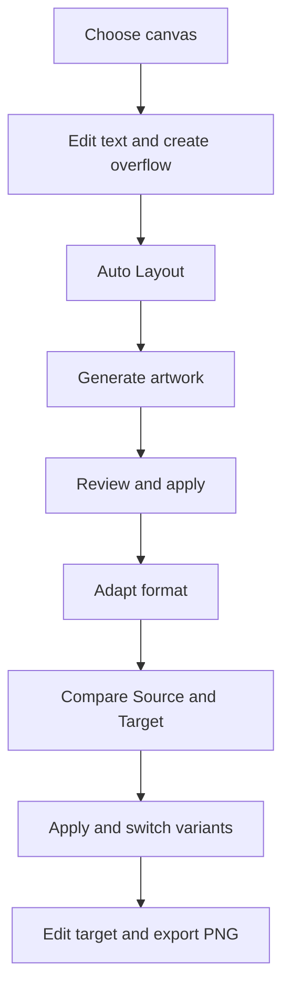
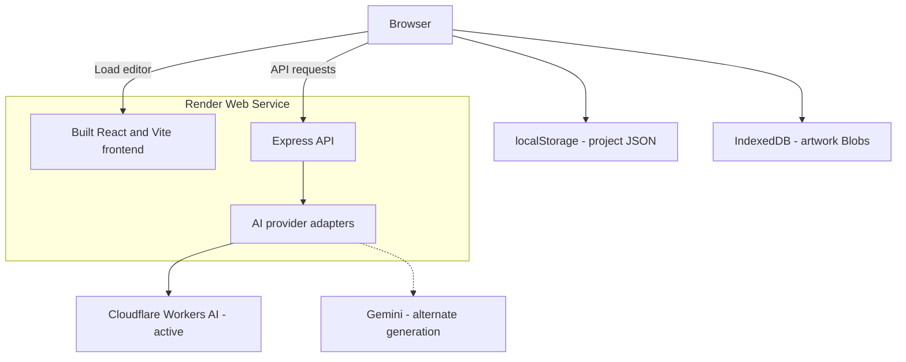
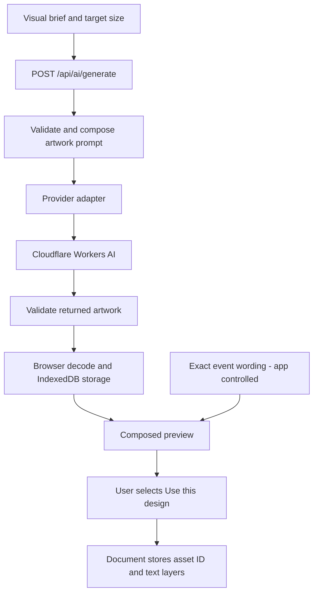
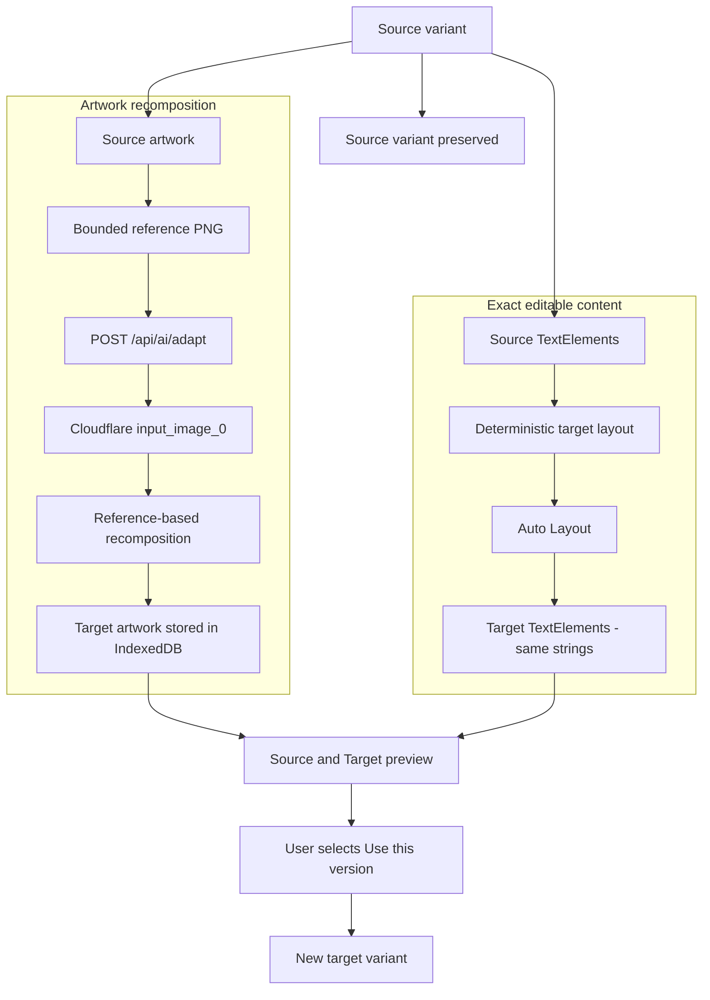
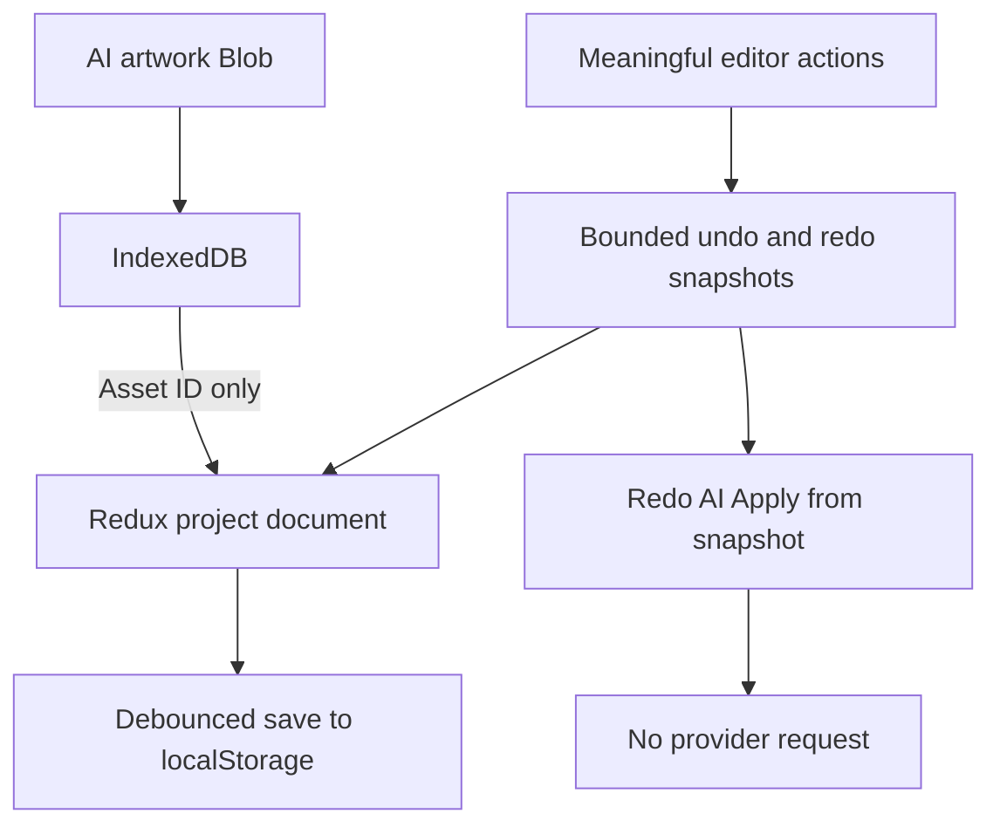
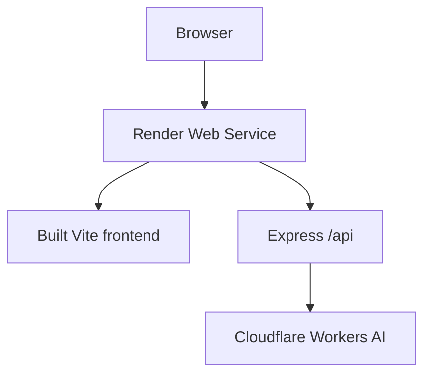

# FrameFlow

A focused design editor for creating event artwork, fitting exact text, and adapting a composition to a new format.

**[Live Demo](https://frameflow-h7fa.onrender.com)** · **[Source Code](https://github.com/rohitpokhariya10/frameflow)**

## Overview

FrameFlow is a Canva-style editor built for the FreshFolks assessment. Choose a canvas, compose editable text, generate decorative artwork, and turn a portrait design into a related landscape composition while keeping both versions.

The central decision is simple: **AI owns the artwork; FrameFlow owns the words.** Names, dates, venues, and headings remain editable text layers. Auto Layout measures and fits those layers locally, while reference-based AI adaptation recomposes the artwork around them.

## Key Features

| Feature | What it does |
| --- | --- |
| Canvas sizing | Poster **1080×1350**, Square **1080×1080**, Landscape **1600×900**, Story **1080×1920**, and validated custom sizes |
| Text editing | Add headings, subheadings, or body text; drag, resize width, edit typography, duplicate, and delete |
| Frame-aware placement | Logical coordinates independent of zoom; overflow feedback and recoverable out-of-frame elements |
| Auto Layout | Measure, wrap, reposition, and reduce text size only when necessary, without changing the wording |
| AI generation | Describe artwork direction, add optional exact event wording, and review before applying |
| AI adaptation | Recompose source artwork for another format and deterministically lay out copies of the exact text |
| Variants | Keep the original and adapted design, compare them, and switch between editable versions |
| Local recovery and history | Save the project and artwork in the browser; undo/redo meaningful edits |
| PNG export | Download the active design at its exact logical dimensions, without editor controls |
| Editable design title | Rename inline, cancel drafts, undo/redo renames, and restore the name after refresh |

Custom canvases accept integer sides from **256–4096 px**, with a maximum area of **12 million pixels**. Side handles reflow text without stretching glyphs; the font-size control changes glyph size. Inter and Lora are bundled locally with their [font licenses](client/public/licenses/).

## FreshFolks Requirement Mapping

| Assessment requirement | FrameFlow implementation | Status |
| --- | --- | --- |
| Select poster, banner, or custom dimensions | Four presets plus validated custom width/height | Implemented; browser verified |
| Add, move, and resize text | Text panel, canvas dragging, width handles, and numeric/typography controls | Implemented; browser verified |
| Place elements within a frame | Frame clipping, logical coordinates, overflow warnings, and recovery through the element list | Implemented; browser verified |
| Auto Layout for overflowing text | Renderer-based fitting with safe margins and readable font limits | Implemented; unit and browser verified |
| Generate themed artwork | Backend integration with Cloudflare Workers AI | Implemented; real generation verified |
| Adapt to another aspect ratio | Source-image reference plus a new target composition | Implemented; real portrait-to-landscape adaptation verified |
| Preserve visual theme | Reference-conditioned palette, motifs, and mood | Visually verified; best-effort generative preservation |
| Preserve exact editable content | App-controlled TextElements copied and reflowed separately from artwork | Exact strings and editability verified |
| Share a live application | Single Render service serving the editor and API | Deployed; hosted browser regression verified |
| Provide source and approach | This repository, architecture diagrams, and engineering notes | Available |

The [master brief](FreshFolks-Assessment-Master-Brief.md) records the original specification. The delivered AI integration uses Cloudflare; Gemini remains an alternate generation adapter, not the production provider.

## Quick Reviewer Demo

Allow roughly 1–2 minutes of interaction, plus provider generation time. AI latency and account allocation vary.

1. Open the **[live app](https://frameflow-h7fa.onrender.com)** and choose **Poster** in Design.
2. Click **Add heading**. In the inspector, replace its content with “The Grand Royal Wedding Palace, Connaught Place, New Delhi, India”. Set **X to 950** and **Y to 1250** to demonstrate overflow.
3. Click **Auto Layout**. Observe the fitted text, then try Undo and Redo.
4. Open **AI → Generate**. Use an artwork direction such as “Ivory florals, warm gold ornamentation, soft romantic lighting”. In the expanded **Exact event wording** section, enter a title, date, and venue; these become the generated design's editable text.
5. Click **Generate design**, inspect the preview, then **Use this design**. Applying generation replaces the active design's artwork and text with the preview; Undo restores the prior design.
6. Choose **Adapt format → Landscape → Adapt artwork**. Compare Source and Target, then select **Use this version**.
7. Switch versions, return to editing if comparison is open, and change the target venue to confirm it remains editable.
8. Rename the design in the top bar. Click **Export PNG**, wait for **Saved on this device**, and refresh to check recovery. Both variants return; the first variant opens by default.



## Architecture

The repository uses three npm workspaces:

- **Client:** React controls, Redux document/history, and Konva rendering. Canvas positions are stored in logical pixels; zoom changes only the view.
- **Server:** Express validates requests, bounds provider work, and keeps credentials server-side. Small provider adapters translate the shared application contract into Cloudflare or Gemini requests.
- **Shared:** TypeScript document/API contracts and handwritten runtime validators used across the application.



The frontend executes in the browser; Render serves its built assets and the API from one origin. There is no project database on the server.

Redux stores serializable documents, asset IDs, UI metadata, and bounded history snapshots. Image Blobs, decoded images, canvas/DOM nodes, object URLs, and request controllers stay outside Redux. This keeps saving and undo/redo predictable without duplicating image data in every snapshot.

## Why Artwork and Text Are Separate

Image models can create visual compositions, but exact event copy needs a stronger guarantee than generated lettering. FrameFlow asks the model for decorative artwork and renders **names, dates, venues, headings, and supporting wording** itself as TextElements.

The server repeats an authoritative artwork-only rule around the visual brief and explicitly excludes source lettering during adaptation. This discourages baked-in copy even when a visual brief requests a name or logo; model compliance is still best effort.

Optional event-content fields stay in the client. During adaptation, every text string—including spaces and explicit newlines—is copied exactly. Font family, weight, and color are retained; geometry and font size can change to fit the target. The model receives the artwork reference and visual instructions, not the editable text elements.

This separation makes a landscape version independently editable and lets the application verify content preservation. Decorative similarity remains a visual judgment; text equality is a deterministic invariant. Preview still matters because generated artwork may contain unwanted lettering or detail in an intended text area.

## Auto Layout

Auto Layout fits the selected text box into a safe region using the same font and Konva measurement rules as the editor:

1. Measure the current text and return unchanged if it already fits.
2. Try a bounded preferred width, then the full available width, at the original font size.
3. Reposition the candidate only as far as needed to bring it inside the region.
4. If necessary, use a bounded search for the largest fitting font above the readable floor.
5. Re-measure before applying. If fitting safely is impossible, retain the original element and show an unresolved warning.

The operation preserves the exact text, uses real renderer measurements rather than character-count estimates, and makes one undoable change. It is **idempotent**: fitting an already-fitted element again makes no change. No AI request is involved. Single-box fitting does not solve collisions between unrelated elements.

[Auto Layout implementation and limits](docs/AUTO_LAYOUT.md)

## AI Artwork Generation

The active provider is **Cloudflare Workers AI**, using **`@cf/black-forest-labs/flux-2-klein-4b`**. The frontend uses a provider-independent request/response contract; credentials and provider payloads belong to the backend.



Artwork must decode and finish its IndexedDB write before the preview becomes ready. The existing document remains unchanged until Apply. Regenerate, Discard, and Cancel are explicit actions; failures do not clear the current design. Applying a preview is one history operation.

Gemini remains an explicitly selected alternate generation provider. Its configured image model had **zero daily Free Tier image quota for this project** during recorded verification. There is no automatic fallback, and Gemini reference adaptation is unavailable.

[AI generation contracts, provider mapping, and evidence](docs/AI_GENERATION.md)

## AI Format Adaptation

Adaptation uses the current artwork as a real visual reference rather than generating solely from a repeated prompt. The browser prepares a proportional PNG thumbnail with a maximum side of **511 px** and a maximum size of **2 MiB**, leaving the original Blob unchanged. The backend validates it and sends its bytes to Cloudflare as multipart **`input_image_0`**.



Portrait-to-landscape adaptation asks for a related composition with decoration toward the left and readable text space on the right. App-controlled semantic regions and Auto Layout place the exact text in the target frame. Other presets have their own arrangements; custom layouts use normalized source positions and may need manual adjustment.

Visual identity is **best-effort generative preservation**, not pixel-identical reproduction. Both previews retain their natural aspect ratios. Source edits, history traversal, version switching, cancellation, and newer requests invalidate obsolete work so a late result cannot silently overwrite the current design.

[AI adaptation design and real verification](docs/AI_ADAPTATION.md)

## Variants

An original Poster and an adapted Landscape remain separate versions of one project. **Use this version** appends and selects the target; it does not overwrite the source. The version selector identifies each format and its Original/Adapted relationship, while **Compare versions** shows both compositions.

Applying adaptation is one undo step. Undo removes that application; Redo restores the saved snapshot without another provider request. Both variants and their artwork survive refresh. Switching versions is UI state, so it does not create a document-history entry.

## Local Persistence and History



The project JSON—including its title, text, variants, and asset IDs—is saved to `localStorage`. Artwork Blobs live in IndexedDB. Normal saving is debounced by 500 ms; the top bar reports success only after the write succeeds. Wait for **Saved on this device** before closing.

History retains up to **30 meaningful document operations**. Typing and numeric editing sessions are grouped; drag, width resize, Auto Layout, rename, and AI Apply have clear commit boundaries. Selection, tabs, and zoom do not fill history. Use the top-bar buttons or Cmd/Ctrl+Z and Cmd/Ctrl+Shift+Z outside typing controls.

Refresh restores the document and artwork, opens the first variant, and starts with empty history. This is **browser-local persistence**, not cloud sync or a backup. Invalid saved documents produce a recovery warning; missing artwork leaves usable text available.

[Persistence, history, and asset lifecycle](docs/PERSISTENCE_AND_HISTORY.md)

## Exact-size PNG Export

**Export PNG** captures the active applied variant at its logical canvas size, independent of viewport zoom and device pixel ratio. It waits for fonts and artwork, then renders the background and text through the same drawing helpers as the editor. Selection handles, comparison frames, and editor chrome are excluded.

Export does not change the document or make an AI/server request. Unapplied previews are not exported. Filenames depend on format and dimensions, never on the user-entered title:

- `frameflow-poster-1080x1350.png`
- `frameflow-landscape-1600x900.png`
- `frameflow-custom-1000x1000.png`

Artwork uses proportional fitting and clipping without stretching. Existing overlaps remain as edited, and content outside the frame is clipped. Export does not silently run Auto Layout.

## Editable Design Title

Click or focus the top-bar **Design name** to edit inline. Enter or blur commits a trimmed name; empty input becomes **New design**. Escape cancels, and committing the same name creates no history entry. Renames support Undo/Redo and refresh recovery through the existing document field. Long names truncate visually while the input stays compact.

## Tech Stack

| Area | Technology |
| --- | --- |
| Frontend | React, TypeScript, Vite |
| State and canvas | Redux Toolkit, Konva, react-konva |
| Styling | Tailwind CSS, custom editor styles, Lucide icons |
| Backend | Node.js, Express, TypeScript |
| Contracts and validation | Shared TypeScript types and handwritten runtime validators |
| Active AI | Cloudflare Workers AI — FLUX.2 Klein 4B |
| Alternate AI | Gemini generation adapter through `@google/genai` |
| Storage | localStorage for document JSON; IndexedDB for artwork |
| Testing | Vitest and Playwright |
| Deployment | Single Render Web Service |

## Project Structure

```text
client/
  src/
    features/       Editor, canvas, text, AI, variants, and PNG export
    store/          Document/UI state, actions, and history
    lib/
      layout/       Deterministic fitting and renderer measurement
      assets/       IndexedDB, image decoding, and reference preparation
      persistence/  Saved-document validation, recovery, and saving
  public/licenses/  Bundled font licenses
server/
  src/
    app.ts          API routes, configuration, validation, and request limits
    index.ts        Server startup and built-client static serving
    providers/      Cloudflare and Gemini adapters
    services/       AI orchestration and image validation
shared/src/         Document/API types, limits, and runtime contracts
tests/e2e/          Browser regression flows at both desktop sizes
docs/               Engineering notes and controlled live evidence
```

## API Endpoints

| Endpoint | Responsibility |
| --- | --- |
| `GET /api/health` | Service status, selected provider, and credential-presence flags; does not call the provider or prove remaining quota |
| `POST /api/ai/generate` | Validate a visual brief, target size, style, and text-space region; return normalized artwork metadata and image data |
| `POST /api/ai/adapt` | Validate a bounded source reference and target intent; return recomposed artwork for the new variant |

AI responses include a request ID. Errors use safe codes and messages. The backend does not store projects or accept arbitrary remote asset URLs to fetch.

## Running Locally

Use **Node 22.12+** and npm. `.nvmrc` selects Node 22; the recorded verification environment used Node 26.3.0 and npm 11.16.0.

```sh
git clone https://github.com/rohitpokhariya10/frameflow.git
cd frameflow
nvm use
npm ci
cp server/.env.example server/.env
```

`npm ci` installs from the committed lockfile; `npm install` is also available for development. Fill the ignored `server/.env` with your own server-side settings:

```dotenv
PORT=3001
AI_PROVIDER=cloudflare
CLOUDFLARE_ACCOUNT_ID=your_account_id
CLOUDFLARE_API_TOKEN=your_token
CLOUDFLARE_IMAGE_MODEL=@cf/black-forest-labs/flux-2-klein-4b
AI_TIMEOUT_MS=120000
CLIENT_ORIGIN=http://localhost:5173
TRUST_PROXY_HOPS=0
```

Then start both development workspaces:

```sh
npm run dev
```

Open **http://127.0.0.1:5173**. Vite proxies `/api` to Express on port 3001; both localhost and 127.0.0.1 development origins are allowed. Restart the server after changing environment settings.

Editing, Auto Layout, export, and mocked tests work without AI credentials. Cloudflare generation/adaptation requires an account ID, a token with Workers AI access, and available allocation. Keep tokens out of `VITE_` variables and source control. To explicitly select the alternate generation adapter, use `AI_PROVIDER=gemini`, `GEMINI_API_KEY`, and `GEMINI_IMAGE_MODEL`; there is no automatic fallback.

| Command | Purpose |
| --- | --- |
| `npm run dev` | Start Vite and the Express TypeScript watcher |
| `npm run typecheck` | Check all workspaces plus browser tests/config |
| `npm run lint` | ESLint checks with zero warnings allowed |
| `npm test` | Run the full Vitest Unit/API suite with provider mocks |
| `npm run build` | Build shared code, the Vite client, and Express server |
| `npm start` | Serve the built client and API through Express; build first |
| `npm run test:e2e` | Run the development browser suite, starting servers as needed |

## Production Deployment

**[FrameFlow on Render](https://frameflow-h7fa.onrender.com)** uses a **single Render Web Service**. Express serves the built Vite frontend and `/api` from the same origin.



The repository's commands support this layout from the repository root:

| Setting | Value |
| --- | --- |
| Build command | `npm ci && npm run build` |
| Start command | `npm start` |
| Health path | `/api/health` |
| Listen address | `0.0.0.0`, using Render's `PORT` |
| Frontend API base | Relative `/api` |

The current same-origin setup does **not** require `VITE_API_BASE_URL`; leave it unset so the built client uses `/api`. Configure provider credentials in Render's server environment, not in a frontend bundle:

```dotenv
AI_PROVIDER=cloudflare
CLOUDFLARE_ACCOUNT_ID=<secret>
CLOUDFLARE_API_TOKEN=<secret>
CLOUDFLARE_IMAGE_MODEL=@cf/black-forest-labs/flux-2-klein-4b
AI_TIMEOUT_MS=120000
CLIENT_ORIGIN=https://frameflow-h7fa.onrender.com
TRUST_PROXY_HOPS=1
```

`CLIENT_ORIGIN` is the **allowed browser/frontend origin**. Here it equals the Render origin because the frontend and API share that origin. `TRUST_PROXY_HOPS=1` accounts for the Render proxy; direct local access uses `0`. Let Render supply its listening port.

## Verification and Testing

The latest full verification, recorded on **22 September 2026** for application commit **`02c8850`**, produced:

| Check | Verified result |
| --- | --- |
| Full Unit/API suite | **336 passed across 26 files** |
| Development browser suite | **124 passed** |
| Built production browser suite | **124 passed** |
| Typecheck | Passed |
| Lint | Passed |
| Build | Passed |
| Focused design-title checks | **3 store + 8 browser tests passed**; also included in full suites |

Browser suites and visual review cover **1366×768** and **1440×900**. Coverage includes canvas sizing, real text rendering and pointer interactions, Auto Layout, save/recovery, history, mocked generation/adaptation, stale results, variants, exact PNG output, and title editing.

To run browser verification:

```sh
npx playwright install chromium
npm run test:e2e
npm run build
PLAYWRIGHT_PRODUCTION=1 npm run test:e2e
```

Use `PLAYWRIGHT_CHANNEL=chrome` with either test command when using installed Chrome instead of bundled Chromium. Stop an independently running development backend before production verification so the suite starts the built Express server. Screenshots and traces are ignored test artifacts.

**Automated provider operations are mocked.** The built production count is against the locally built app. A separate full run against the deployed Render service also passed **124 tests**, with every AI provider call mocked. The hosted page and `/api/health` returned HTTP 200; health reported `provider=cloudflare`, `aiConfigured=true`, and `aiAvailable=true`. Final screenshot review covered both desktop sizes, including long document titles, inspector/Auto Layout, AI forms, loading/error states, composed comparison and version switching.

## Real AI Verification

The final release check exercised the deployed Render UI and Cloudflare
`@cf/black-forest-labs/flux-2-klein-4b` with **FitnessHUB Opening**:

| Operation | Observed result |
| --- | --- |
| Generation | **HTTP 200**, **JPEG 816×1024**, for a **1080×1350** logical poster |
| Adaptation input | Actual source artwork thumbnail: **PNG 407×511**, **255,351 bytes**; the tested server adapter sends binary `input_image_0` |
| Adaptation output | **HTTP 200**, **JPEG 1024×576**, for a **1600×900** logical landscape |
| Exact editable text | **Grand Opening** and **FitnessHUB** preserved in source and target TextElements and composed comparison |
| PNG export | Poster **1080×1350** and landscape **1600×900**, without editor controls |
| Request discipline | **One live generation + one live adaptation; no provider retries** |

Preview-before-Apply, source preservation and atomic Undo/Redo passed in the live
flow. A browser-session closure interrupted the subsequent adaptation download
check. Recovery verification replayed the already returned adaptation locally,
with all live AI requests blocked, then passed Apply/history, inspector editing,
source/target switching, refresh, a fresh browser restart and landscape export. The original artwork's
SHA-256 remained unchanged. This recovery did not regenerate artwork.

Visual review found black/gold geometric identity preserved in a recomposed
landscape with more open space on the right, rather than stretched source pixels.
Neither raw image contained readable lettering. Decoration still crosses part of
the default title position in both results; manual repositioning can improve
contrast. The no-text/quiet-space prompt is best effort, while exact text preservation
is controlled by FrameFlow.

Provider artwork resolution is separate from the document's logical dimensions.
FrameFlow records actual returned dimensions and fits/crops artwork proportionally
without stretching; PNG export uses the exact logical canvas size. Current release
evidence is in [Implementation status](IMPLEMENTATION_STATUS.md); the
[generation](docs/AI_GENERATION.md) and [adaptation](docs/AI_ADAPTATION.md) notes
retain detailed earlier milestone checks.

## Security

- **Server-only credentials:** Provider keys stay in the server environment. Real `.env` files are ignored; examples contain placeholders.
- **Explicit API origins:** CORS uses an exact allowlist of local development origins plus `CLIENT_ORIGIN`, without wildcard credential access. CORS is not user authentication.
- **Runtime validation:** Shared handwritten validators check API inputs; saved documents are validated on recovery. Request sizes, dimensions, style fields, and image metadata are bounded.
- **Image checks:** The backend checks image signatures, decoded byte sizes, and dimensions; the browser fully decodes artwork before storage/preview. Generation JSON is limited to 24 KiB and adaptation JSON to 3 MiB.
- **Bounded provider work:** Generation and adaptation share three requests per IP per minute and a maximum of two active requests per server process, with timeout/abort handling.
- **Safe failures:** Normalized errors and request IDs avoid exposing provider payloads or credentials. Logs omit full prompts and image bytes. No automatic provider retry loop consumes quota after ambiguous failures.
- **Stale-result protection:** Cancelled, superseded, or obsolete responses cannot silently replace current work.

## Trade-offs and Limitations

- **Generative continuity:** Palette, motifs, and mood are preserved best-effort. Inspect previews for unwanted lettering or decoration near text; custom layouts can need manual adjustment.
- **Provider allocation:** Cloudflare quota and availability are bounded. Rate limiting is per process, not a distributed budget system. Cancelling does not guarantee remote processing or charging stops.
- **Local storage:** One project per browser origin, without accounts, cloud backup, or cross-device sync. Clearing/evicting storage removes recovery data; history and selected-version preference do not persist. Multiple tabs use the last successful save.
- **Layout scope:** Up to 30 variants and 50 text elements per variant, with 5,000 characters per element. Single-element Auto Layout is not a general collision-solving design engine.
- **Desktop-first editing:** Both supported desktop sizes are verified. Narrow screens show a desktop-editing notice rather than a full mobile editor.
- **Rendering and export:** Provider dimensions can differ from logical dimensions, so proportional cover may crop. Large PNGs depend on browser memory; downloads can also be limited by browser or disk policies. Emoji and scripts outside the bundled Latin fonts use platform fallbacks.

## Documentation

- [AI generation](docs/AI_GENERATION.md) — provider contracts, asset flow, and real generation evidence
- [AI adaptation](docs/AI_ADAPTATION.md) — source reference processing, exact text, variants, and live comparison
- [Auto Layout](docs/AUTO_LAYOUT.md) — measurement, fitting policy, and invariants
- [Persistence and history](docs/PERSISTENCE_AND_HISTORY.md) — recovery, snapshots, and IndexedDB lifecycle
- [Implementation status](IMPLEMENTATION_STATUS.md) — dated verification results and development history

Detailed notes preserve historical milestone decisions and deployment plans. This README describes the current submission and single-service Render deployment.

## Live Demo / Repository

**[Open FrameFlow](https://frameflow-h7fa.onrender.com)** · **[Browse the source](https://github.com/rohitpokhariya10/frameflow)**
